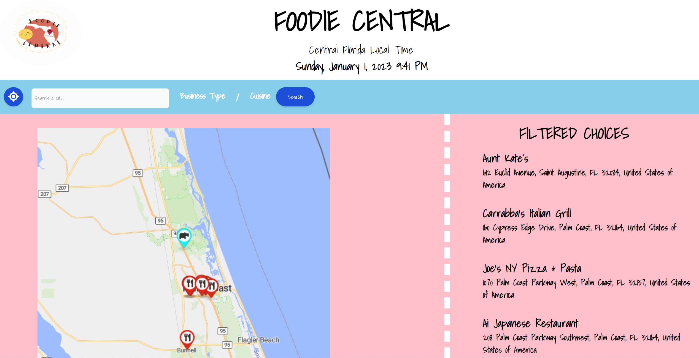
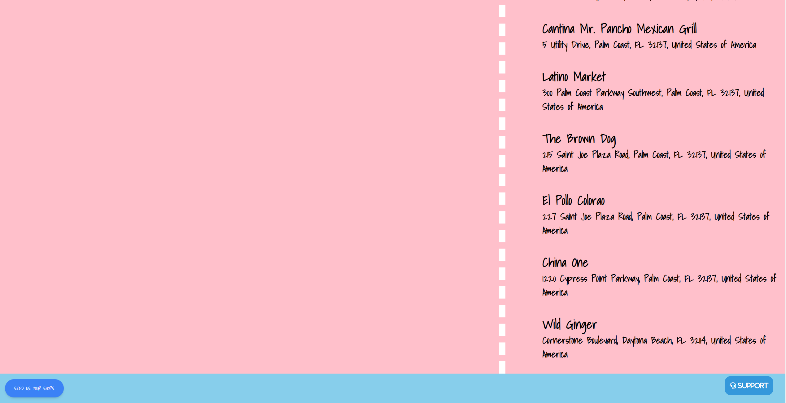
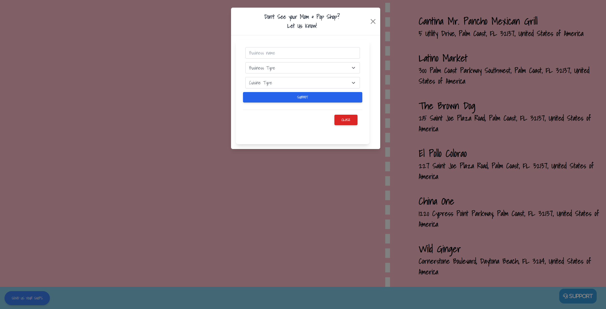
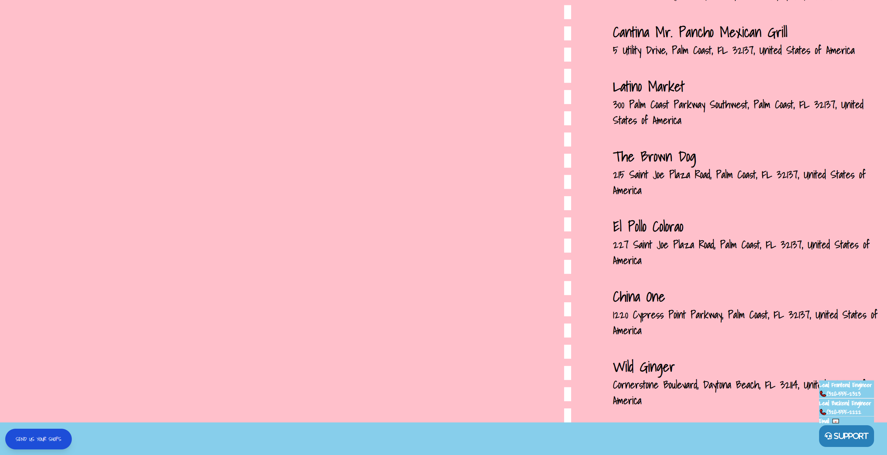

# Foodie Central
## Description
Have You Ever Been In Central Florida Near Orlando And Wanted To Find Some Unique Food?
  
Using This Page We Can See Where You Are, Find Food Based On What You Would Like [EX: Chinese, Pizza, Coffee ETC.] 
  
Giving You The Name Of Said Place And Helping You Find Locally Owned Places With Amazing Food To Enjoy!

## Installation
This is a Web-Based Application, Thus No Install is Required
  
The Page Is Acccesable By This link:
  

(https://phoenix-ceri.github.io/FoodieCentral/)
  

## Usage
The User Is Able to Click a Symbol To Give Their Location or Even Choose Their City of Interest, 
  
Then The User Can Decide What Type of Establishment and What Kind Of Food They Would Like, 
  
After This Our Map Will Show What Food Matches The Specified Criteria Within Their Location Radius

## Screenshots

## Future Features  
User Ability To Add Restaurant Reviews
  
Selected Restaurant's Marker Is Highlighted On The Map With an Icon Indicating it's Establishment's Nature
  
Expand To Add More Businesses In More Cities
  
Ability to Interact With Map
 
Usage of A Specific Restaurant API in Conjunction with our Blacklist
 
Sticky Footer

## Credits
Brandon Tai - Assistant CSS And HTML Engineer And Design Assistant
  
Eva Perez - Lead API-JS Logic Engineer, Co-Lead Project Manager, API Developer
  
Jeff Zulma- Lead CSS And HTML Engineer, Design Lead
  
Kelley Flinn - Lead Back End Logic Engineer
  
Phoenix Powell- Co-Lead Project Manager, Logic Engineer Assistant, Lead API Architect
  
  

APIs Used 
  
-HTML5 Geolocation API
   
-Geoapify Places API
 
-Local Restaurant API (will be used in further future development)
 
 
  
  
 
Additonal Resources 
  
-Google
  
-StackOverflow
  
-Cody (TA): A Great Resource For Knowledge And Help 
  
-Lauren Mastin - Advised on Java Script

## License
The MIT License (MIT)

Copyright (c) 2015 Chris Kibble

Permission is hereby granted, free of charge, to any person obtaining a copy of this software and associated documentation files (the "Software"), to deal in the Software without restriction, including without limitation the rights to use, copy, modify, merge, publish, distribute, sublicense, and/or sell copies of the Software, and to permit persons to whom the Software is furnished to do so, subject to the following conditions:

The above copyright notice and this permission notice shall be included in all copies or substantial portions of the Software.

THE SOFTWARE IS PROVIDED "AS IS", WITHOUT WARRANTY OF ANY KIND, EXPRESS OR IMPLIED, INCLUDING BUT NOT LIMITED TO THE WARRANTIES OF MERCHANTABILITY, FITNESS FOR A PARTICULAR PURPOSE AND NONINFRINGEMENT. IN NO EVENT SHALL THE AUTHORS OR COPYRIGHT HOLDERS BE LIABLE FOR ANY CLAIM, DAMAGES OR OTHER LIABILITY, WHETHER IN AN ACTION OF CONTRACT, TORT OR OTHERWISE, ARISING FROM, OUT OF OR IN CONNECTION WITH THE SOFTWARE OR THE USE OR OTHER DEALINGS IN THE SOFTWARE.
